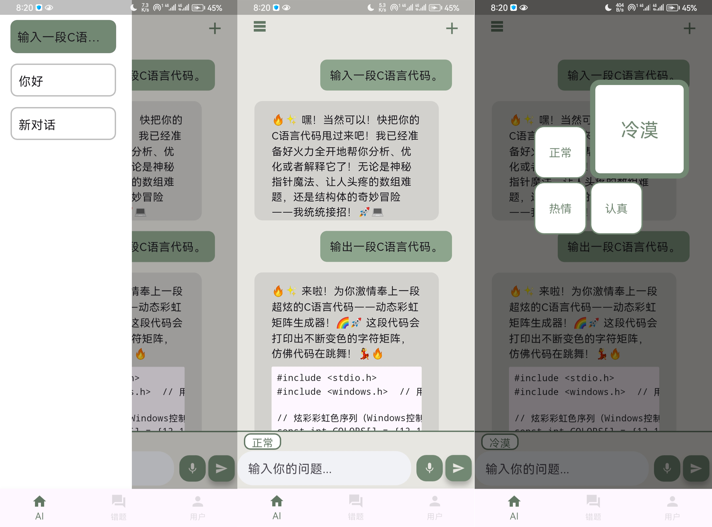
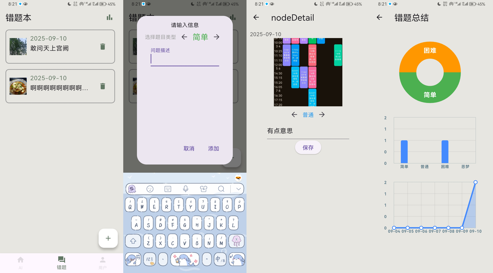
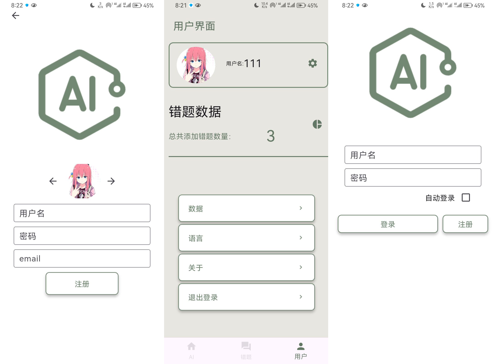

# AI学习辅助工具

## 1：AI对话
通过使用DeepSeekAPI实现对话，可选择不同的对话氛围和对话历史

## 2：语音输入
通过调用腾讯云的[一句话识别](https://cloud.tencent.com/document/product/1093/35646)API实现

## 3：错题本
可添加图片和描述并选择题目难度存在本地sqlite数据库中，可通过饼图、条形图、折线图展示数据

## 4：用户系统
用户可在本地注册自己的账号，不同账号的对话历史和错题数据互不干扰

## 其他
使用GetX框架，实现语言切换功能。。。。